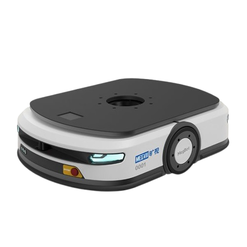
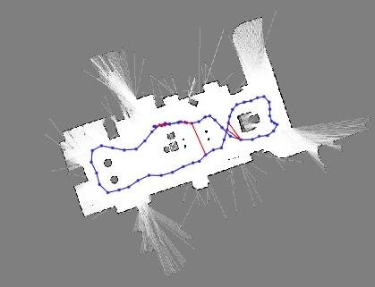
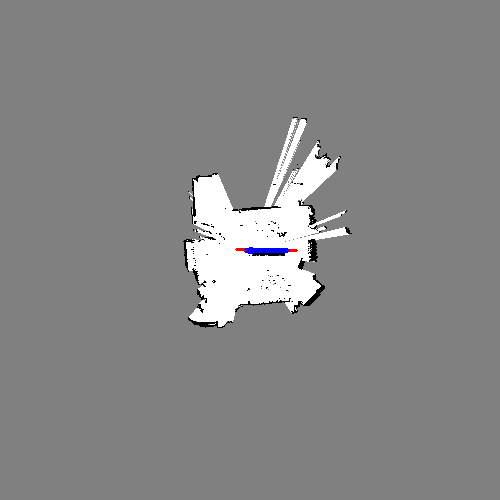

# AMR Control User Interface

This repository contains a web-based user interface for controlling and monitoring an Autonomous Mobile Robot (AMR) developed by **Team 1**. Built with [React](https://reactjs.org/) and [Vite](https://vitejs.dev/) in TypeScript, the application communicates with the AMR over MQTT to:

* Start and stop mapping
* Receive and display real‑time map images (reconstructed from base64 chunks)
* View live X/Y coordinates of the robot
* Send target coordinates for navigation
* Download reference documentation (Design Report, Reference Design, User Manual)

---

## Table of Contents

* [Features](#features)
* [Screenshots](#screenshots)
* [Getting Started](#getting-started)

  * [Prerequisites](#prerequisites)
  * [Installation](#installation)
  * [Running the App](#running-the-app)
* [Configuration](#configuration)
* [Project Structure](#project-structure)
* [Documentation](#documentation)
* [License](#license)

---

## Features

* **MQTT Integration:** Connects to a WebSocket MQTT broker (`ws://test.mosquitto.org:8081`) to subscribe/publish on topics:

  * `amr/state` (commands: `map`, `start`, `stop`)
  * `amr/coordinates/x-axis`
  * `amr/coordinates/y-axis`
  * `amr/map/image` (base64‑encoded image chunks)
* **Real-Time Mapping:** Reassembles image chunks into a live map display with progress indicator
* **Interactive Map:** Click on the map to set a target coordinate; displays a pointer overlay
* **Coordinate Controls:** Manually enter X/Y in the range **–250** to **250** (units = *5 cm* per grid cell)
* **Documentation Access:** Quick buttons in the header to view/download PDF documents:

  * Design Report
  * Reference Design
  * User Manual
* **Responsive UI:** Shrinks header on scroll, fixed background image, and adaptive layout

---

## Screenshots

<div align="center">



|       Map Placeholder       |           Live Map with Pointer          |
| :-------------------------: | :--------------------------------------: |
|  |  |

</div>

---

## Getting Started

### Prerequisites

* [Node.js](https://nodejs.org/) (v16+ recommended)
* npm (comes with Node.js)

### Installation

1. **Clone the repository**

   ```bash
   git clone https://github.com/your-org/User-Interface.git
   cd User-Interface
   ```

2. **Install dependencies**

   ```bash
   npm install
   ```

### Running the App

* **Development server**

  ```bash
  npm run dev
  ```

  The app will be available at `http://localhost:5173` by default.

* **Production build**

  ```bash
  npm run build
  ```

* **Preview production build**

  ```bash
  npm run preview
  ```

---

## Configuration

* **MQTT Broker URL** – located in `src/App.tsx` as `MQTT_BROKER_URL`.
* **MQTT Topics** – also in `src/App.tsx` under constants `MQTT_STATE_TOPIC`, etc.

You can modify these values to point to your own broker or topics.

---

## Project Structure

```
User-Interface/
├─ public/                  # Static assets
│  └─ vite.svg
├─ src/                     # Application source code
│  ├─ assets/               # Icons and images
│  ├─ App.tsx               # Main React component
│  ├─ App.css               # Component-level styles
│  ├─ index.css             # Global styles
│  ├─ main.tsx              # App entry point
│  ├─ AMR_Image.png         # Robot header image
│  ├─ Map.png               # Map placeholder
│  ├─ map_with_ellipse_full.png  # Sample mapped image
│  ├─ background.png        # Background image
│  ├─ design_report.pdf     # Design report PDF
│  ├─ referenceDesign.pdf   # Reference design PDF
│  └─ user_manual.pdf       # User manual PDF
├─ index.html               # HTML template
├─ package.json             # npm dependencies & scripts
├─ tsconfig.json            # TypeScript configuration
├─ vite.config.ts           # Vite configuration
└─ README.md                # This file
```

---

## Documentation

Click the **User Manual**, **Design Report**, or **Reference Design** buttons in the top header to open the corresponding PDF in a new tab.

---

## License

This project is licensed under the [MIT License](LICENSE).
